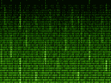

```zsh
        __ _   _ ___ _____ ___  _         __ ___ _____ _          _    
       / ___| | | |_ _|_   _/ _ \| |     |  _ \_ _|_   _| | | |  / \   
      | |   | |_| || |  | || | | | |     | |_) | |  | | | |_| | / _ \  
      | |___|  _  || |  | || |_| | |___  |  __/| |  | | |  _  |/ ___ \ 
       \____|_| |_|___| |_| \___/|_____| |_|  |___| |_| |_| |_/_/   \_\

```
<p align="center">
  <a href="http://nestjs.com/" target="blank"></a>
</p>


## Description
Chitolpitha is a scalable, reusable boilerplate which helps to build SASS Application

## Installation

```bash
$ npm install
```

## Running the app

```bash
# development
$ npm run start

# watch mode
$ npm run start:dev

# production mode
$ npm run start:prod
```

## Test

```bash
# unit tests
$ npm run test

# e2e tests
$ npm run test:e2e

# test coverage
$ npm run test:cov
```


```graphql
mutation {
  signup(signupUserInput: {name: "SAMAYUN", email: "samayun@gmail.com", password: "123456"}) {
     accessToken
  }
}

query {
  signin(signinUserInput: { email: "samayun@gmail.com", password: "123456"}) {
     accessToken
  }
}


```
